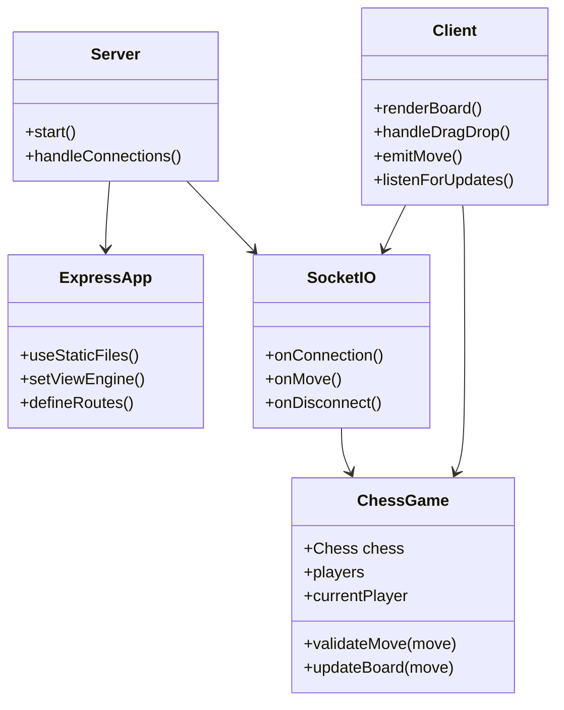

# Realtime Chess Application

This is a **Realtime Chess Application** built using **Node.js**, **Express**, **Socket.IO**, and **EJS**. It allows two players to play chess in real-time, while additional users can join as spectators. The application uses the `chess.js` library to handle chess logic and enforce game rules.

## Features

- **Real-time Gameplay**: Players can make moves in real-time, and the board updates for all connected users.
- **Player Roles**: Users are assigned roles as either "White", "Black", or "Spectator".
- **Drag-and-Drop Interface**: Intuitive drag-and-drop functionality for moving chess pieces.
- **Responsive Design**: The chessboard adjusts for smaller screens.
- **Spectator Mode**: Users who join after two players are already connected can watch the game as spectators.

## Technologies Used

- **Node.js**: Backend runtime environment.
- **Express**: Web framework for handling routes and middleware.
- **Socket.IO**: Real-time bidirectional communication between server and clients.
- **EJS**: Templating engine for rendering dynamic HTML.
- **chess.js**: Library for chess logic and rules enforcement.
- **dotenv**: For managing environment variables.

## Installation

1. Clone the repository:

   ```bash
   git clone <repository-url>
   cd chess
   ```

2. Install dependencies:

   ```bash
   npm install
   ```

3. Create a `.env` file in the root directory and specify the port (optional):

   ```
   PORT=5500
   ```

4. Start the application:

   - For production:
     ```bash
     npm start
     ```
   - For development (with live reload):
     ```bash
     npm run dev
     ```

5. Open your browser and navigate to `http://localhost:5500`.

## Application Structure

```plaintext
chess/
├── public/               # Static files (CSS, client-side JS)
│   ├── style.css         # Styles for the chessboard and UI
│   ├── script.js         # Client-side logic for rendering and interaction
├── views/                # EJS templates
│   └── index.ejs         # Main HTML template
├── index.js              # Server-side logic
├── package.json          # Project metadata and dependencies
├── .gitignore            # Ignored files for Git
└── README.md             # Documentation
```

## Class Diagram

Below is a class diagram of the application, generated using Mermaid:



## How It Works

1. **Server**:

   - The server initializes an Express app and a Socket.IO instance.
   - It listens for client connections and assigns roles (White, Black, or Spectator).
   - It validates moves using `chess.js` and broadcasts updates to all clients.

2. **Client**:
   - The client renders the chessboard dynamically using DOM manipulation.
   - Players can drag and drop pieces to make moves, which are sent to the server via Socket.IO.
   - Spectators receive real-time updates of the board state.

## Dependencies

- `chess.js`: Handles chess logic and rules.
- `dotenv`: Loads environment variables.
- `ejs`: Renders dynamic HTML templates.
- `express`: Web framework for routing and middleware.
- `socket.io`: Enables real-time communication between server and clients.

## License

This project is licensed under the **ISC License**.

## Author

Developed by **Nilav**.
